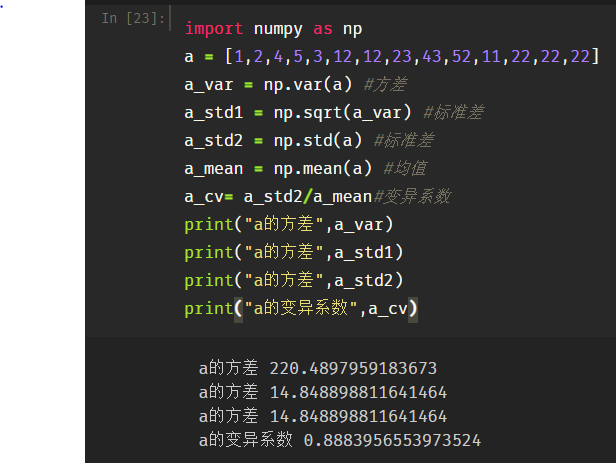
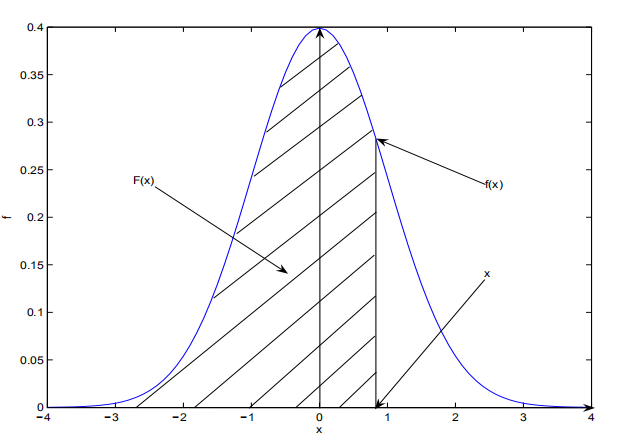
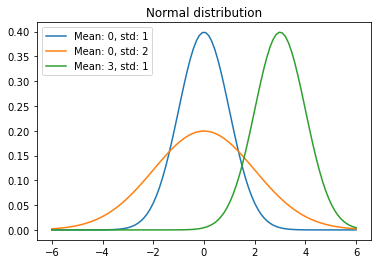
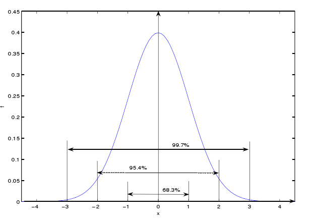
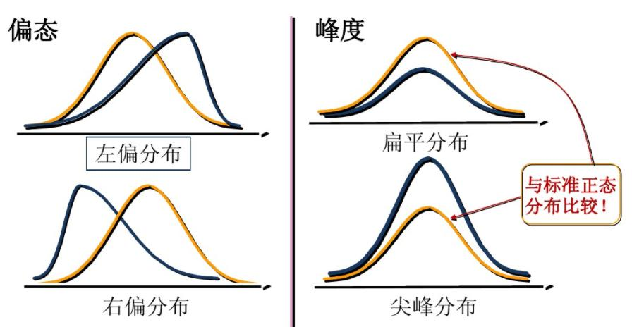
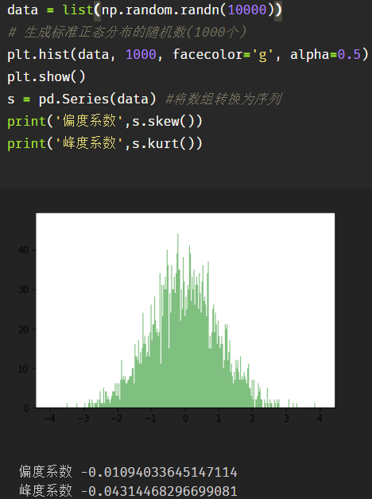

# 一、数理统计概念

## 1.基本概念释义

总体：研究对象的全体，通常用一个随机变量表示。

个体：组成总体的每个基本单元。

从总体$X$中随机抽取一部分个体$X_1,X_2,...,X_n$，称$X_1,X_2,...,X_n$为取自$X$的容量为$n$的样本。实际上，数理统计学中的总体是指与总体相联系的某个(某几个)数量指标$X$取值的全体。

样本具有两重性，在一次具体抽样后是一组确定的数值。一般叙述中由于采取随机抽样，样本是一组随机变量(结果未知)。

一般地，用$X_1,X_2,...,X_n$，表示随机样本，取到的值记为$x_1,x_2,...,x_n$称为样本观测值。$n$为样本容量。

样本分布：样本作为随机变量的概率分布。显然，样本分布取决于总体的性质和样本的性质。

## 2.统计量与抽样

数理统计的任务是采集和处理带有随机影响的数据，或者说收集样本并对之进行加工，在此基础上对研究的问题进行分析并作出一定的结论，这一过程称为统计推断。在统计推断过程中，对样本进行加工整理，实际上就是根据样本计算出一些量，把研究问题相关的信息集中起来。这种根据样本计算出的量就是统计量。因此，统计量是样本的某种函数。

定义：设 $X_1,X_2,...,X_n $ 是总体 $X$ 的一个简单随机样本， $T(X_1, X_2,...,X_n)$ 为一个 $n$ 元连续函数，且 $T$ 中不包含任何关于总体的未知参数，则称 $T(X_1, X_2,...,X_n)$ 是一个统计量，称统计量的分布为抽样分布。

### 常用的统计量

样本均值

设 $X_1,X_2,...,X_n $ 是总体 $X$ 的一个简单随机样本，称$\overline X =  \frac{1} {n} {\sum_{i=1}^{n}X_i}$为样本均值。通常用样本均值来估计总体分布的均值和对有关总体分布均值的假设作检验。

样本方差

设 $X_1,X_2,...,X_n $ 是总体 $X$ 的一个简单随机样本，$\overline X$ 为样本均值，称$S^2 =  \frac{1} {n-1} {\sum_{i=1}^{n}(X_i-\overline X)^2}$为样本方差。

通常用样本方差来估计总体分布的方差和对有关总体分布均值或方差的假设作检验。

k阶样本原点矩

设 $X_1,X_2,...,X_n $ 是总体 $X$ 的一个简单随机样本，称$A_k =  \frac{1} {n} {\sum_{i=1}^{n}X_i^k}$

为样本的 $k$ 阶原点矩（可以看到 $k=1$ 时，相当于样本均值），通常用样本的无阶原点矩来估计总体分布的 $k$ 阶原点矩。（可以看到 $k=1$ 时，相当于样本均值）

通常用样本的无阶原点矩来估计总体分布的 $k$ 阶原点矩。

k阶样本中心矩

设 $X_1,X_2,...,X_n $ 是总体 $X$ 的一个简单随机样本，$\overline X$ 为样本均值，称$M_k =  \frac{1} {n} {\sum_{i=1}^{n}(X_i-\overline X)^k}$为样本的 $k$ 阶中心矩。

通常用样本的 $k$ 阶中心矩来估计总体分布的 $k$ 阶中心矩。

顺序统计量

设 $X_1,X_2,...,X_n $ 是抽自总体 $X$ 的样本，$x_1,x_2,...，x_n$  为样本观测值。将 $x_1,x_2,...，x_n$  按照从小到大的顺序排列为$x_{(1)}<=x_{(2)}<=...<=x_{(n)}$。

当样本 $X_1,X_2,...,X_n $ 取值 $x_1,x_2,...，x_n$  时，定义 $X_{(k)}$ 取值 $X_{(k)}(k=1,2，...,n)$，称  $X_{(1)},X_{(2)},...,X_{(n)} $ 为 $X_1,X_2,...,X_n $ 的顺序统计量。

显然，$X_{(1)} =min {X_i}$ 是样本观察中最小的一个，称为最小顺序统计量。$X_{(n)} =max {X_i}$ 是样本观测值中取值最大的一个，成为最大顺序统计量。称$X_{（r）}$ 为第 $r$ 个顺序统计量。

# 二、描述性统计

## 1.数据集中趋势的度量

平均数

是表示一组数据集中趋势的量数，是指在一组数据中所有数据之和再除以这组数据的个数。
$$
\overline X =  \frac{1} {n} {\sum_{i=1}^{n}X_i}
$$
中位数

是指在一组数据，按顺序排列后，居于中间位置的数。中位数描述数据中心位置的数字特征。

对于对称分布的数据，均值与中位数比较接近；对于偏态分布的数据，均值与中位数不同。中位数不受异常值的影响，具有稳健性。
$$
m_p=\left\{
\begin{array}{lcl}
x_{[np]+1},       &      & {当np不是整数}\\
\frac{1}{2}(x_{(np)}+x_{(np+1)})     &      & {当np是整数时}\\
\end{array} \right.
$$
频数

同一观测值在一组数据中出现的次数（掷骰子中，一共掷了20次，出现数字5的次数）。

众数

就是一组数据中，出现次数最多的那个数（几个数）。

均值 vs 中位数 vs 众数

|        |                         优点                         |       缺点       |
| :----: | :--------------------------------------------------: | :--------------: |
|  均值  |              充分利用所有数据，适用性强              | 容易受极端值影响 |
| 中位数 |                    不受极端值影响                    |    缺乏敏感性    |
|  众数  | 不受极端值影响；当数据具有明显的集中趋势时，代表性好 |    缺乏唯一性    |

百分位数

百分位数是中位数的推广，将数据按从小到大排列后，对于$0 \leq p < 1$，它的p分位点定义为
$$
m_p=\left\{
\begin{array}{lcl}
x_{[np]+1},       &      & {当np不是整数}\\
\frac{1}{2}(x_{(np)}+x_{(np+1)})     &      & {当np是整数时}\\
\end{array} \right.
$$
其中，**[np]**表示**np**的整数部分。所以，0.5分位数（第50百分位数）就是中位数。

### python实现

## 2.数据离散趋势的度量

表示数据分散（离散，差异）程度的特征量有方差，标准差，极差以及变异系数等。

方差

用来计算每一个变量（观察值）与总体均数之间的差异。实际工作中，总体均数难以得到时，应用样本统计量代替总体参数，经校正后，样本方差计算公式:
$$
s^2 = \frac{1}{n-1}\sum_{i=1}^{n}{(x_i-\overline{x})}^2
$$
标准差

样本方差的开平方成为样本标准差。
$$
s=\sqrt{s^2}=\sqrt{\frac{1}{n-1}\sum_{1}^{n-1}{(x_i-\overline{x})}^2}
$$
极差
$$
R=X_{(n)}-x_{(1)}=\max(x)-\min(x)
$$
数据越分散，极差越大。

变异系数

- 是刻画数据相对分散性的一种度量。变异系数只在平均值不为零时有定义，而且一般适用于平均值大于零的情况。变异系数也被称为**标准离差率**或**单位风险**。
- 当需要比较两组数据离散程度大小的时候，如果两组数据的测量尺度相差太大，或者数据量纲的不同，变异系数可以消除测量尺度和量纲的影响。

$$
CV=100\times\frac{s}{x}(\%)
$$

四分位差

样本上、下四分位数之差称为四分位差(或半极差)。
$$
R_1 = Q_3 - Q_1
$$
它也是度量样本分散性的重要数字特征，特别对于具有异常值的数据，它作为分散性具有稳健性  **（见百分位数示意图）**。

### python实现

## 3.分布特征

 **引言：**描述一个随机变量，不仅要说明它能够取那些值，而且还要关心它取这些值的概率（可能性）。

离散变量和连续变量

- 离散型随机变量：其数值只能用**自然数或整数**单位表示。例如，  班级人数，电脑台数等，只能按计量单位数计数，这种变量的数值一般用计数方法取得。
- 连续变量：在一定区间内可以任意取值的变量。例如，人体测量的身高，体重等。

概率函数：用函数的形式来表达概率。

- **连续型随机变量**的概率函数就叫做**概率密度函数**。
- **离散型随机变量**的概率函数就叫做**概率质量函数**。

分布函数

设$X$是一个随机变量，对任意的实数$x$，令$F(x)=P(X<=x),x \in (-\infty,+\infty)$，则称$F(x)$是随机变量$X$的分布函数(概率累积函数)。

​                                                                密度函数与分布函数关系 

正态分布：也称高斯分布，是一个非常常见的连续概率分布，概率密度函数为
$$
f(x) = \frac{1}{\sqrt{2\pi}\sigma}\exp{\{- \frac{(x-u)^2}{2\sigma^2} \}}, \qquad -\infty<x<+\infty 
$$
则称$X$服从$N(u,\sigma^2)$分布。

​                                                             正态分布的概率密度函数曲线 

​                                                            标准正态分布和对应区间上积分（面积）的百分比 

这个概念可以推广到一般正态分布。$[u-3\sigma,u+3\sigma]$的概率密度曲线之下的面积占总面积的99.7%，是著名的$3\sigma$原则。

## 4. 偏度与峰度

偏度（skewness）：也称为偏态，是统计数据分布偏斜方向和程度的度量，是统计数据分布非对称程度的数字特征。直观看来就是密度函数曲线尾部的相对长度。**偏度刻画的是分布函数（数据）的对称性。**

关于均值对称的数据其偏度系数为0，右侧更分散的数据偏度系数为正，左侧更分散的数据偏度系数为负.

- **正态分布的偏度为0，两侧尾部长度对称。**

- **左偏:**   

  1）若以$b_s$表示偏度。$b_s<0$称分布具有**负偏离**，也称左偏态；

  2）此时数据位于均值左边的比位于右边的少，直观表现为左边的尾部相对于与右边的尾部要长；

  3）**因为有少数变量值很小，使曲线左侧尾部拖得很长；**

- **右偏：**

  1）$b_s>0$称分布具有**正偏离**，也称右偏态；

  2）此时数据位于均值右边的比位于左边的少，直观表现为右边的尾部相对于与左边的尾部要长；

  3）**因为有少数变量值很大，使曲线右侧尾部拖得很长；**

峰度(peakedness;kurtosis)：说明的是分布曲线在平均值处峰值高低的特征数。直观看来，峰度反映了峰部的尖度。样本的峰度是和正态分布相比较而言统计量，如果峰度大于正态分布峰度，峰的形状比较尖，比正态分布峰要陡峭。反之亦然。**峰度刻画的是分布函数的集中和分散程度。**

### 公式与python实现

样本偏度系数：
$$
g_1 = \frac{n}{(n-1)(n-2)s^3}\sum_{i=1}^{n}{(x_i-\overline{x})}^3=\frac{n^2 u_3}{(n-1)(n-2)s^3}
$$
样本峰度系数：
$$
g_2 = \frac{n(n+1)}{(n-1)(n-2)(n-3)s^4}\sum_{i=1}^{n}{(x_i-\overline{x})}^4-3\frac{(n-1)^2}{(n-2)(n-3)}
$$

